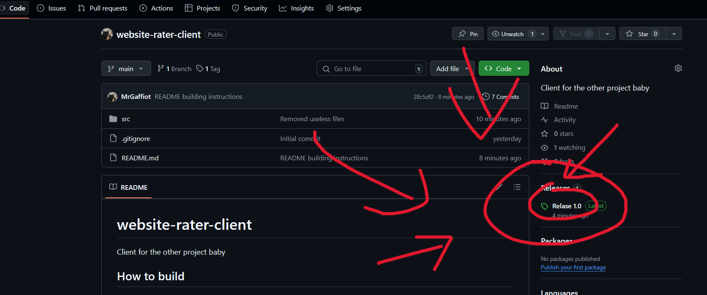
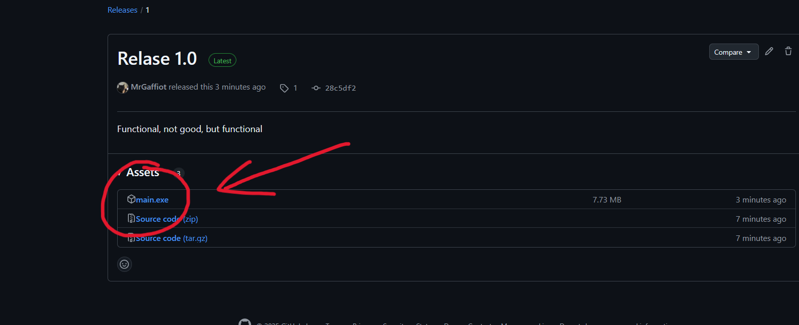

# website-rater-client
Client for the other project baby

## Jak buildnout (tohle není tak důležitý pro negramotný jedince jako je Zdeněk)
1. nainstaluj všechny dependencís
2. nainstaluj pajsamoinstalovač
```bat
pip install -U pyinstaller
```
3. jdi do src
4. běž
```bat
pyinstaller main.py
```

## Jak používat
1. stáhni .exe soubor z vydaní tady z gitu 


2. stáhni package.zip z Discordu (!generate <číslo>, když tak !help)
3. vŠechny soubory z package.zip dej do stejný složky jako exe soubor
4. odpracuj si co sis navařil (když se obrázek přestane měnit tak je to hotový)
5. vezmi nově vytvoření soubor exportData.json a pošli ho botovy (nahraj ho, a v stejný zprávě dej !upload, když tak !help)
6. ### *smaž všechny soubory krom main.exe*
